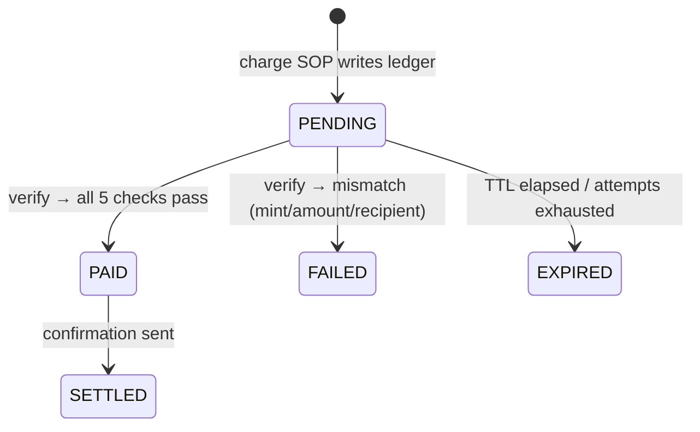
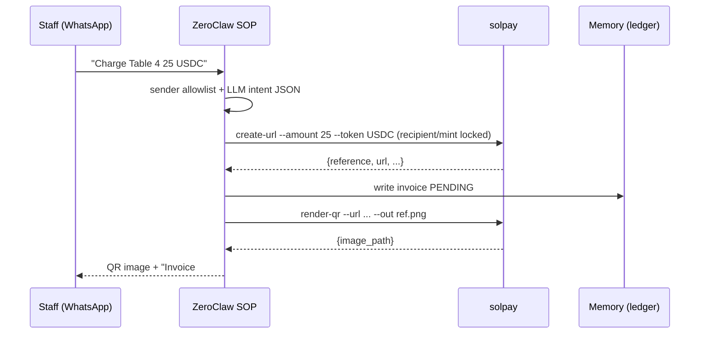
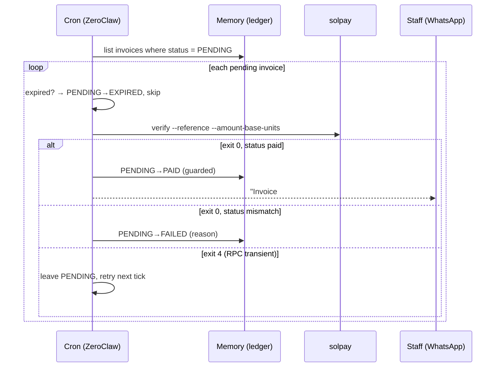

# Architecture

The design goal is simple to state and hard to earn: **an AI agent can accept a
payment, but no part of the system can move or hold funds, and the LLM can never
make a decision about money.**

## Two planes

Everything is split into an untrusted, probabilistic plane (language) and a
trusted, deterministic plane (money). They meet only at a validated JSON contract.

```
        UNTRUSTED / PROBABILISTIC              TRUSTED / DETERMINISTIC
      ┌────────────────────────────┐        ┌──────────────────────────────┐
WA ─► │ ZeroClaw channel (WhatsApp)│        │ solpay (stateless Rust CLI)  │
      │ sender allowlist gate      │        │  money.rs   integer amounts  │
      │ LLM: message → intent JSON │ intent │  domain/    state + validate │
      │ LLM: friendly reply text   │ ─────► │  solana/    url · qr · verify│
      └────────────────────────────┘  JSON  │  never signs · no privkey    │
                    ▲                        └──────────────┬───────────────┘
                    │ reply / QR                            │ reads only
                    └───────────────── ZeroClaw ────────────┘
                     SOP (deterministic) · cron · memory (ledger)
```

If the LLM's output fails schema/bounds validation, the request is rejected
before any Solana logic runs. Prompt injection therefore cannot set the
recipient wallet, the token, or bypass amount limits — those come from **locked
config, never from the message.**

## Layers (each replaceable, single responsibility)

| Layer | Where | Responsibility |
|---|---|---|
| Channel / adapter | ZeroClaw gateway (WhatsApp) | receive/send messages + media |
| Authorization | ZeroClaw channel `dm_policy=allowlist` + `peer_groups` | only staff numbers can charge |
| Intent (NLU) | ZeroClaw + LLM | `"Charge Table 4 25 USDC"` → intent JSON |
| Orchestration | ZeroClaw SOP (deterministic mode) | sequence steps; **no LLM on the money path** |
| Domain | `solpay` `domain/` | invoice state machine + validation (pure) |
| Money / Solana | `solpay` `money`, `solana/` | amounts, Pay URL, QR, on-chain verify |
| Persistence | ZeroClaw memory (SQLite) | invoice ledger (single source of truth) |
| Scheduler | ZeroClaw cron | poll pending invoices; expire stale ones |

The agent layers (channel, SOP, cron, memory) are ZeroClaw built-ins. The only
bespoke code is `solpay`, and it is **stateless** — it holds no database and no
keys.

## The fetch/decide split (why verification is trustworthy)

Inside `solpay`, network I/O and the payment verdict are separated on purpose:

- `solana/rpc.rs` **fetches** — JSON-RPC over a small blocking HTTP client behind
  an `HttpTransport` trait, with ordered endpoint failover and bounded retries.
- `solana/verify.rs` **decides** — a pure function of already-fetched evidence.

Because the verdict never touches the network, every case is tested offline
against fixtures, and a flaky or hostile node cannot perturb the money decision.

## Invoice state machine



Transitions are driven **only** by deterministic code and on-chain evidence.
Terminal states are frozen, and a settlement is applied only while the invoice
is still `PENDING` — so a confirmation is sent exactly once (idempotency).

## The `charge` flow



## The `verify_payments` flow (cron)



## Why this design is better

- **The LLM cannot lose your money** — money logic is deterministic and unit-tested; the LLM is confined to language.
- **Non-custodial** — no private keys, no signing, no custody; the scariest half of the threat model does not exist.
- **Maximally ZeroClaw** — channels, SOP, cron, memory are built-ins; almost no bespoke framework code (true Tier-1).
- **Reproducible & auditable** — one stateless binary, pinned toolchain, committed lockfile, 115 tests, clippy-clean.

See also: [`THREAT_MODEL.md`](THREAT_MODEL.md), [`CONFIGURATION.md`](CONFIGURATION.md),
and the decision records under [`adr/`](adr/).
